## nordVPN. bosch.peter@icloud.com. 

## NordPass We lock passwords. bosch.peter@icloud.com. You hold the key. F0B.....9#
Store passwords in a single place and log in to your favorite websites and apps with a click. 
[With NordPass](https://nordpass.com/?utm_medium=affiliate&utm_term&utm_content&utm_campaign=off490&utm_source=aff34741&aff_free&url=%7Burl%7D), access your login credentials on any device, even when you’re offline.

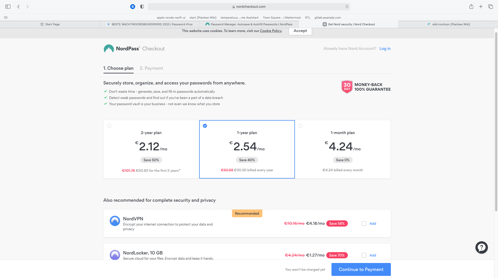
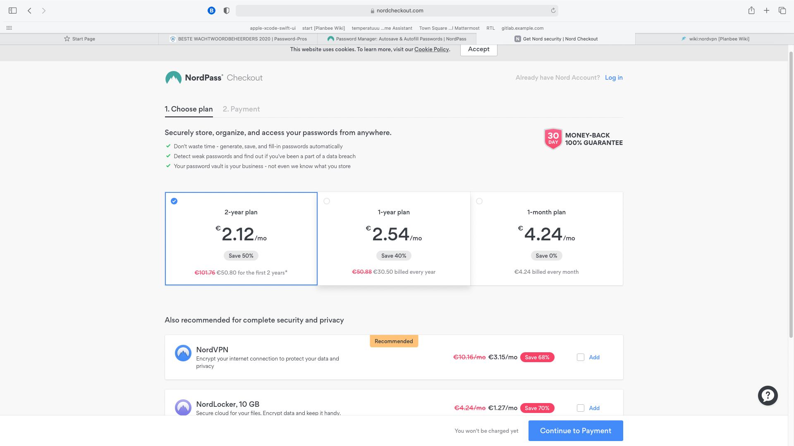
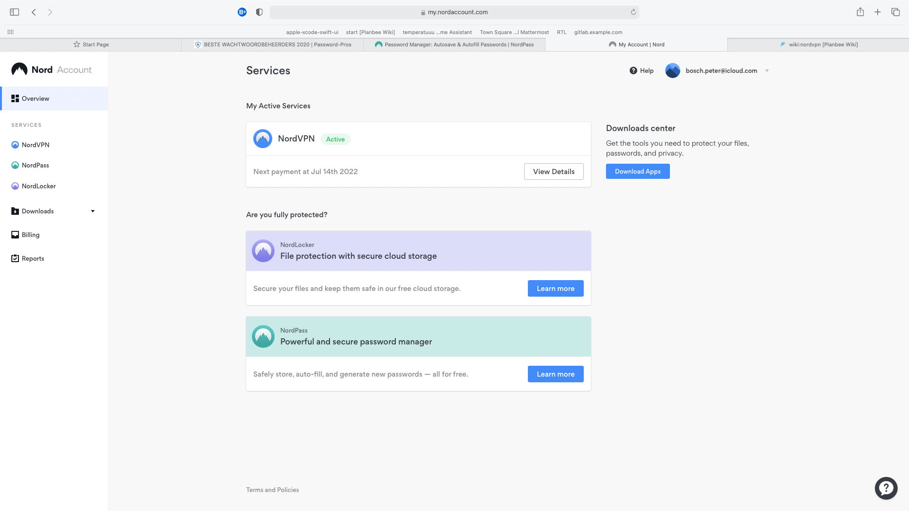

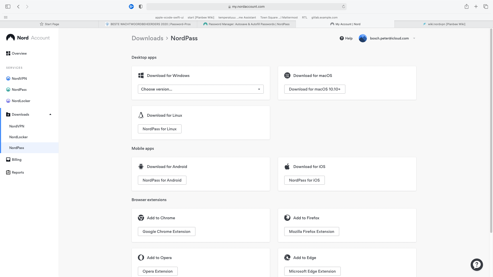
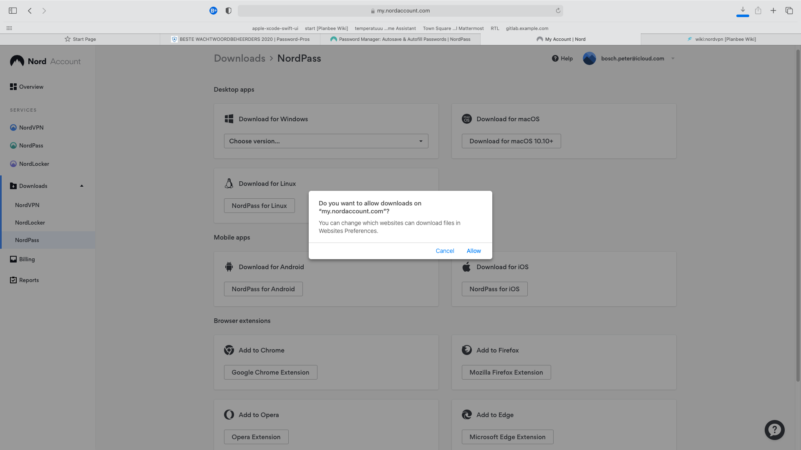
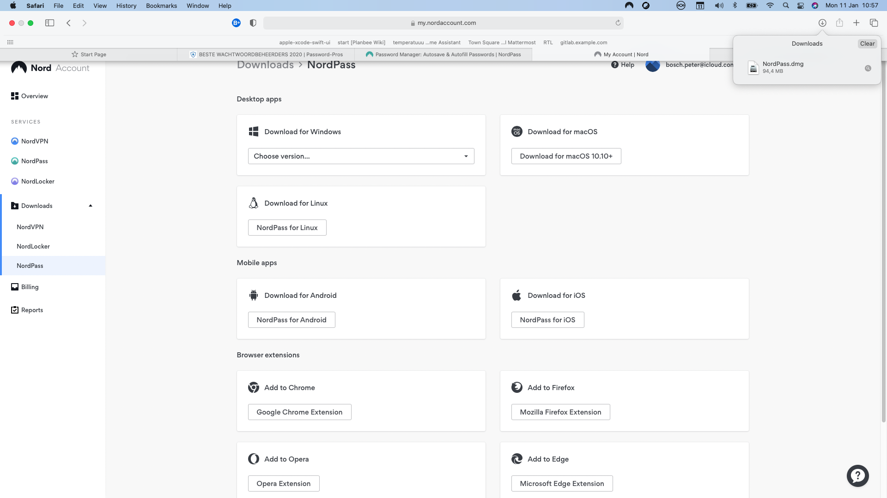
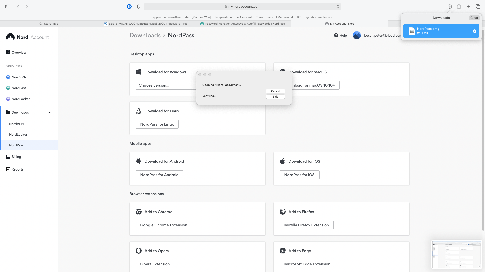
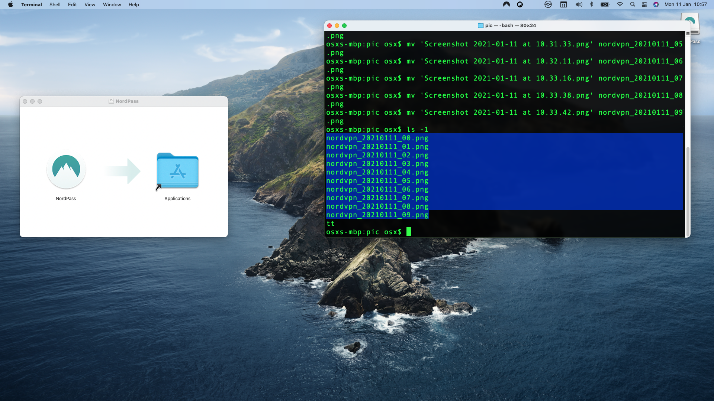
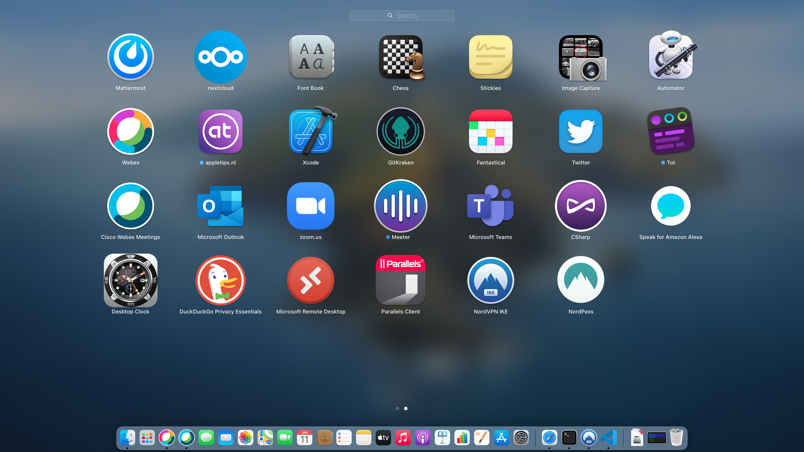
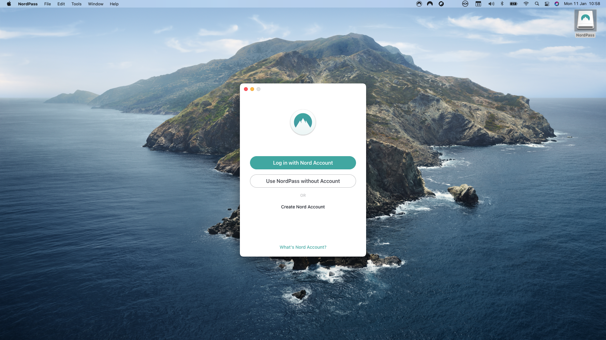
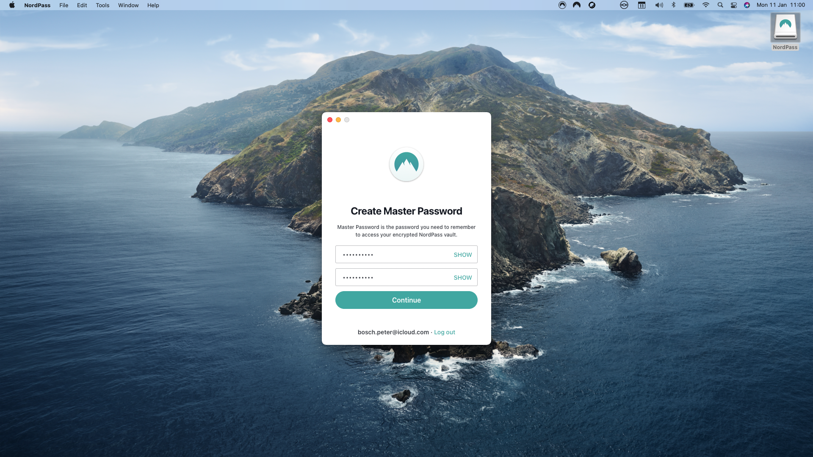

