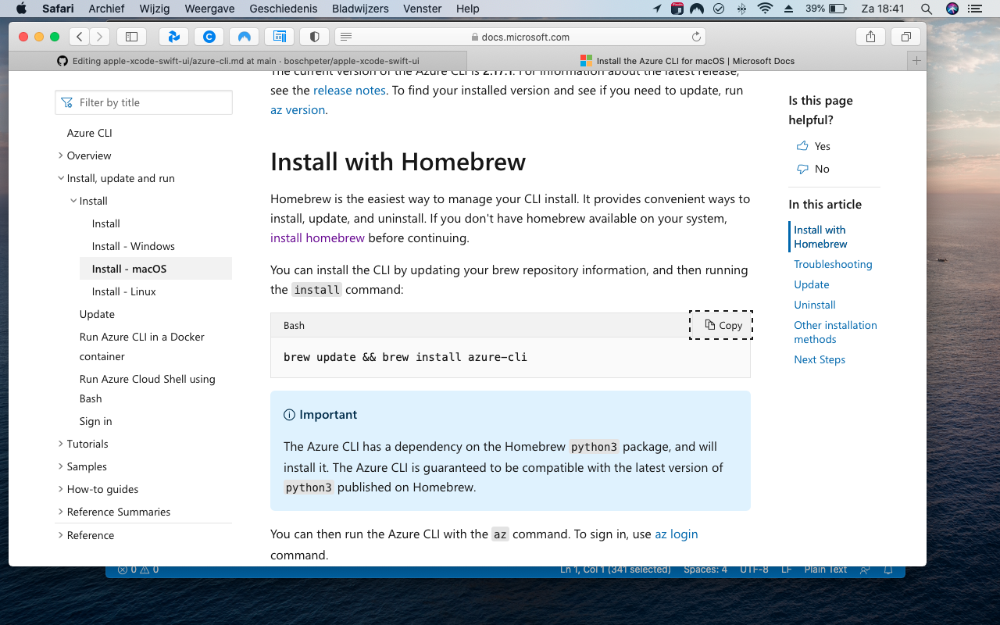
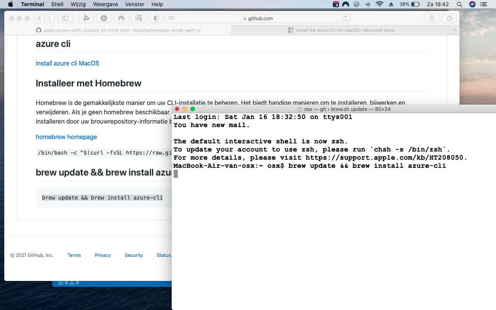
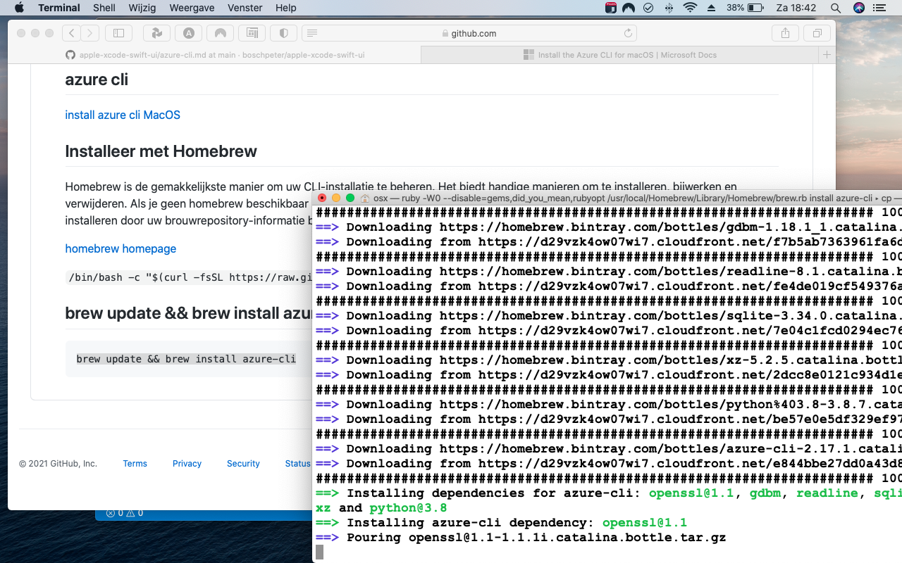
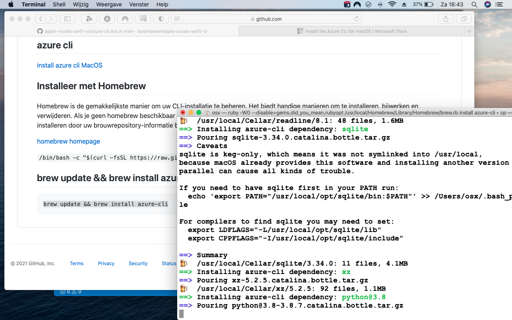
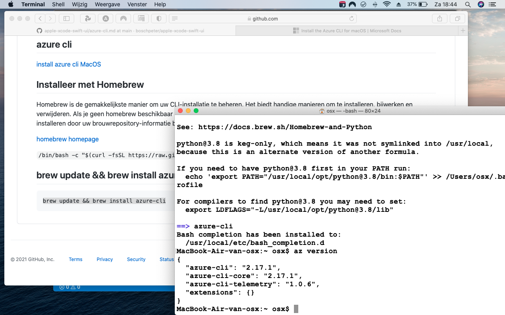
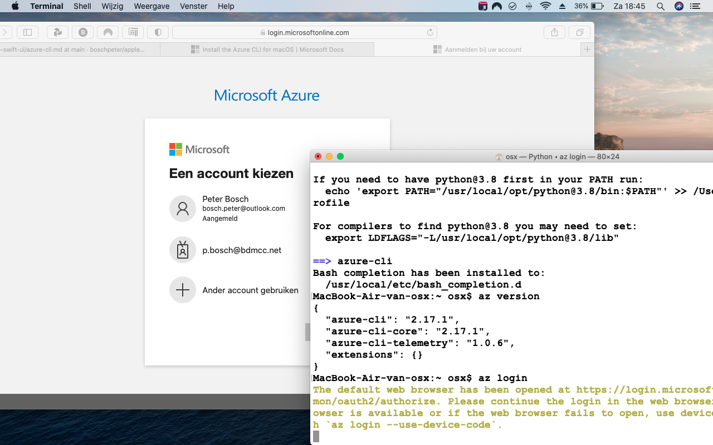
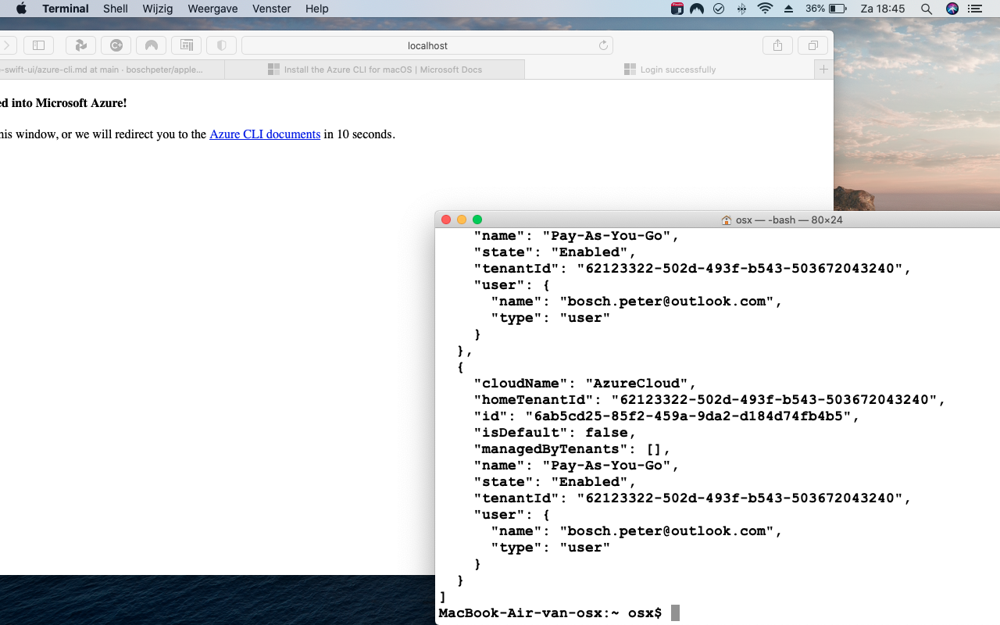
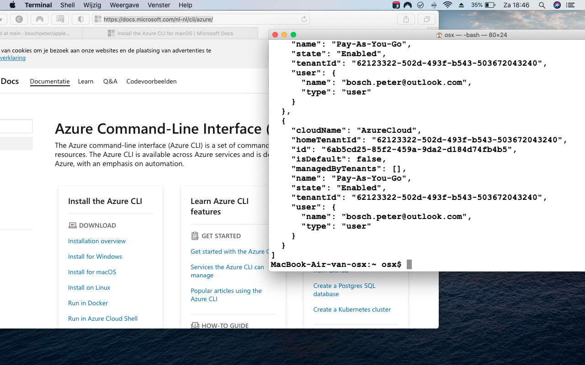
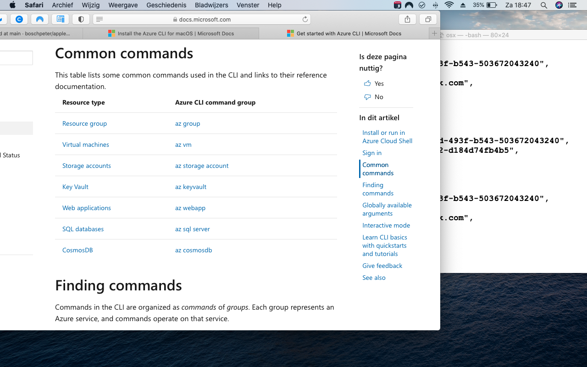
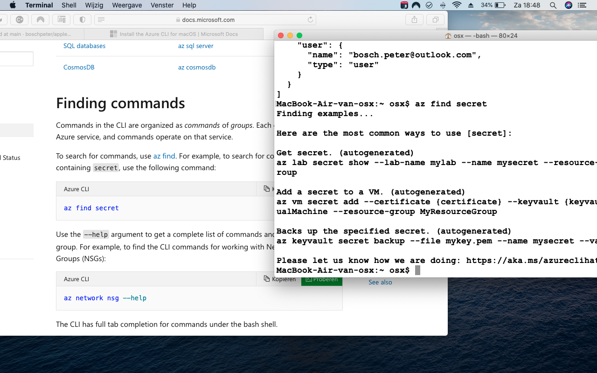

## azure cli

[install azure cli MacOS](https://docs.microsoft.com/en-us/cli/azure/install-azure-cli-macos)

## Installeer met Homebrew
Homebrew is de gemakkelijkste manier om uw CLI-installatie te beheren. Het biedt handige manieren om te installeren, bijwerken en verwijderen. Als je geen homebrew beschikbaar hebt op je systeem, installeer dan homebrew voordat je verder gaat.
U kunt de CLI installeren door uw brouwrepository-informatie bij te werken en vervolgens de installatieopdracht uit te voeren:

[homebrew homepage](https://docs.brew.sh/Installation.html)

````/bin/bash -c "$(curl -fsSL https://raw.githubusercontent.com/Homebrew/install/HEAD/install.sh)"````

## brew update && brew install azure-cli

````
brew update && brew install azure-cli
````











