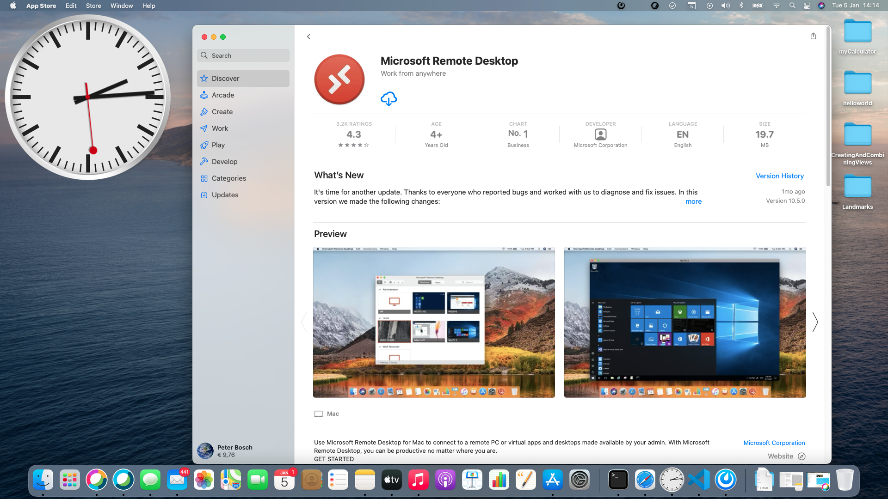
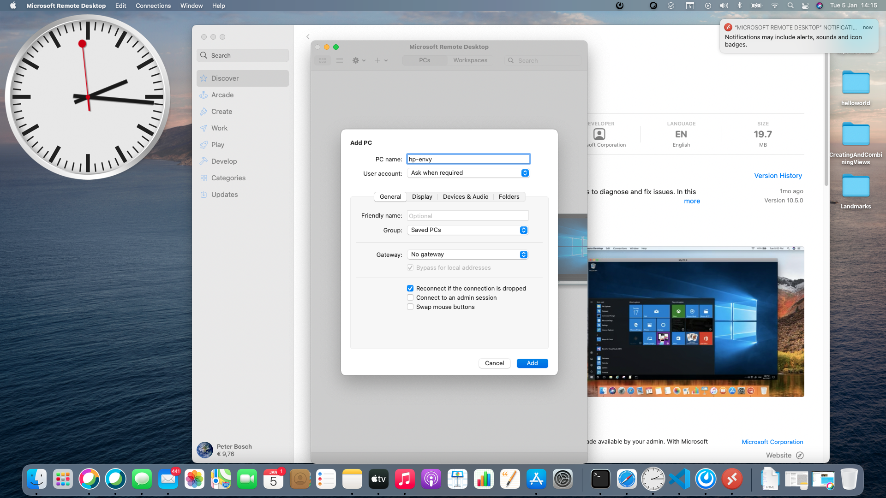
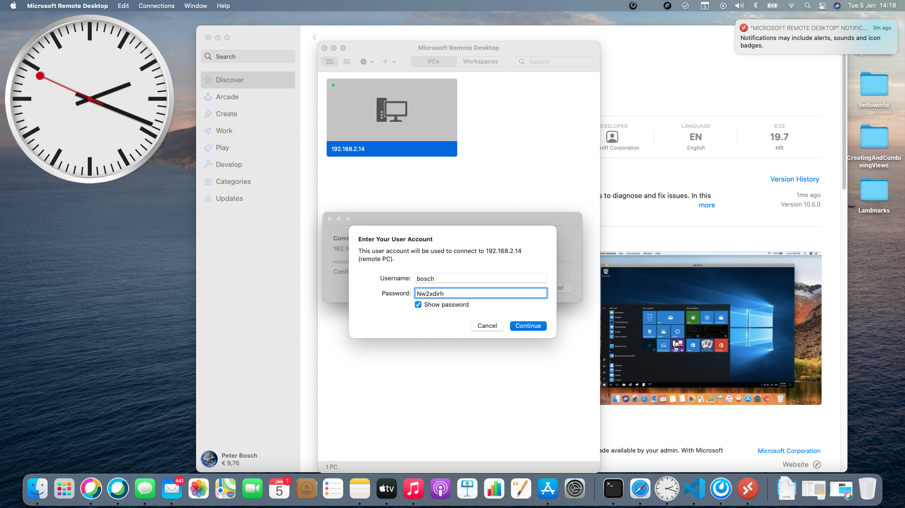
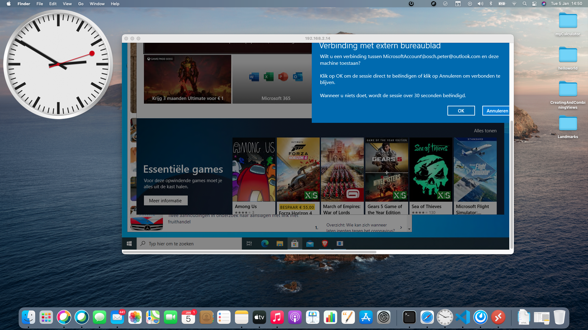
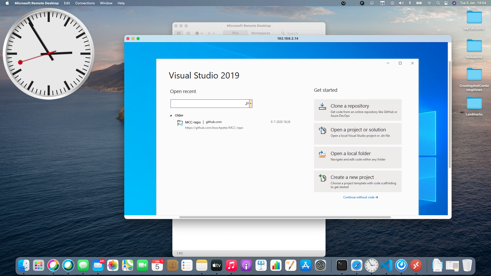
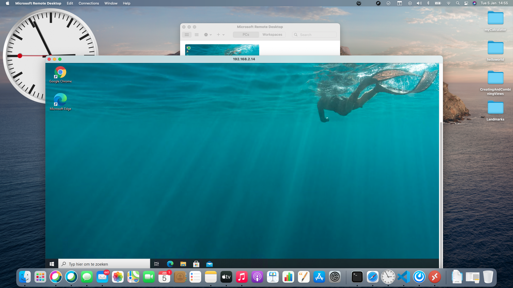
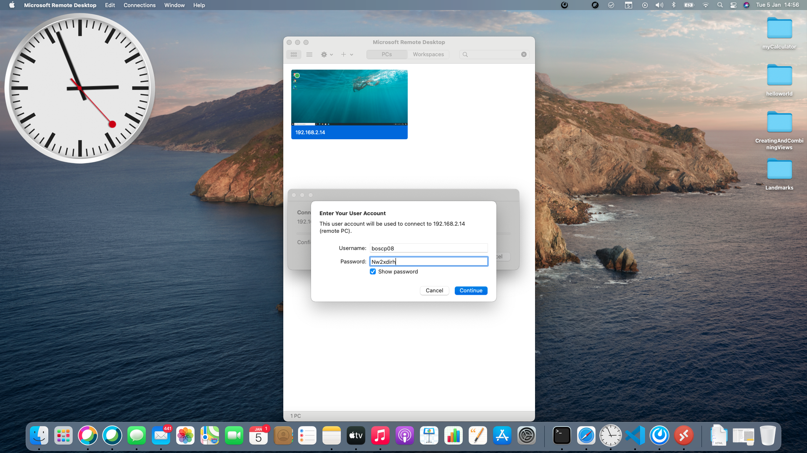

## net user /add [*username] [password]
## net localgroup administrators [username] /add
[create-admin-user-account-using-cmd-prompt-windows](https://operating-systems.wonderhowto.com/how-to/create-admin-user-account-using-cmd-prompt-windows-0125689/)

