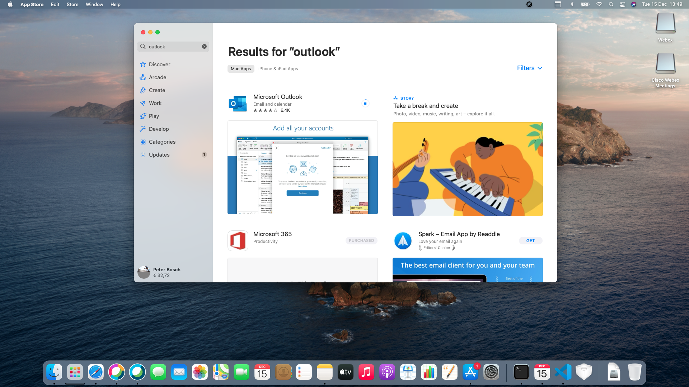
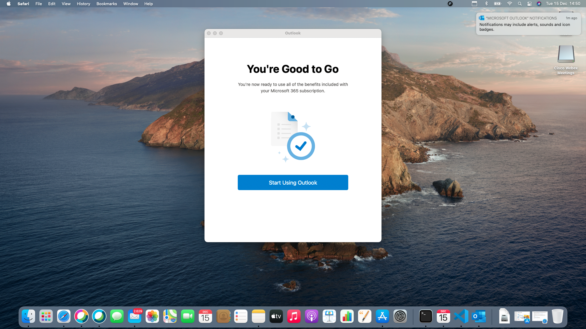
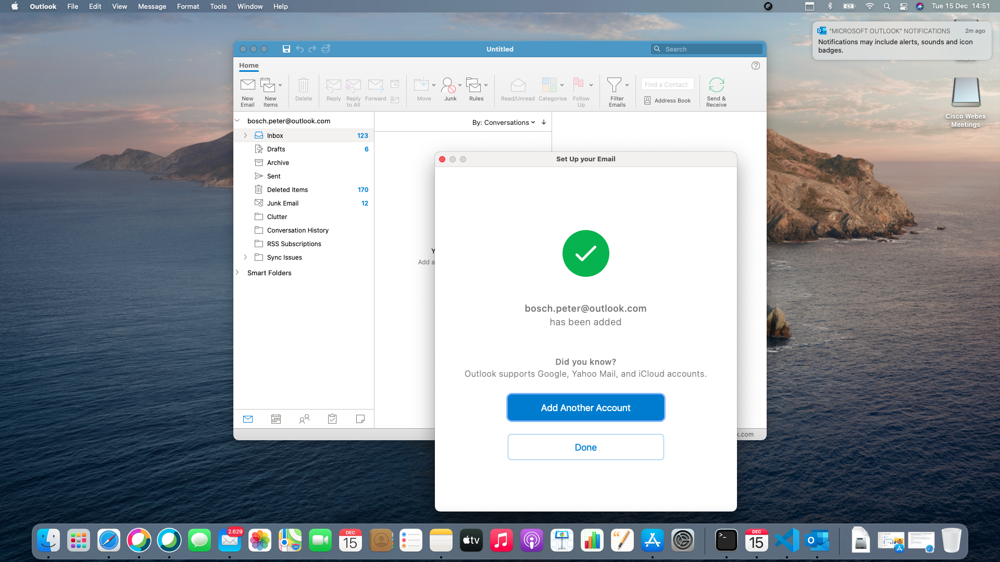
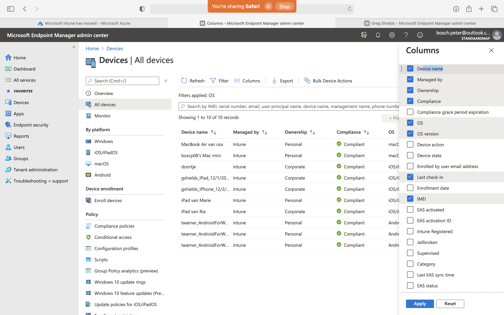
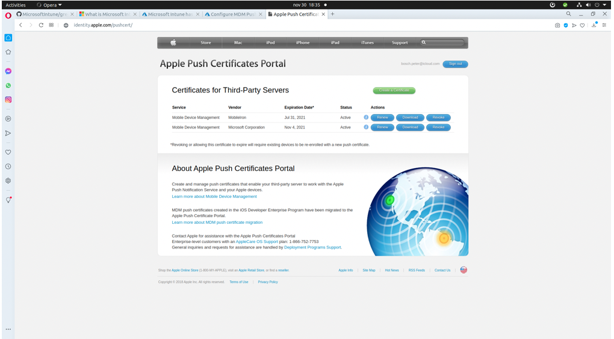
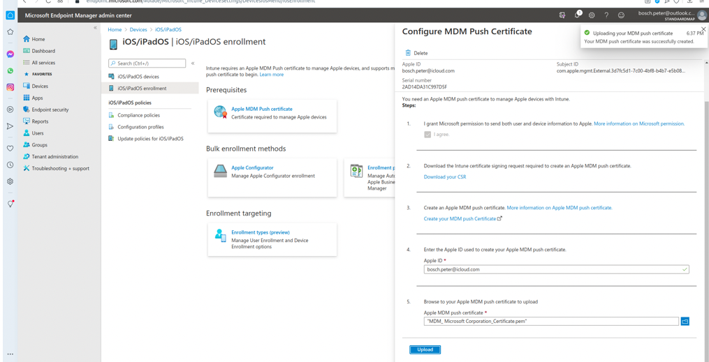
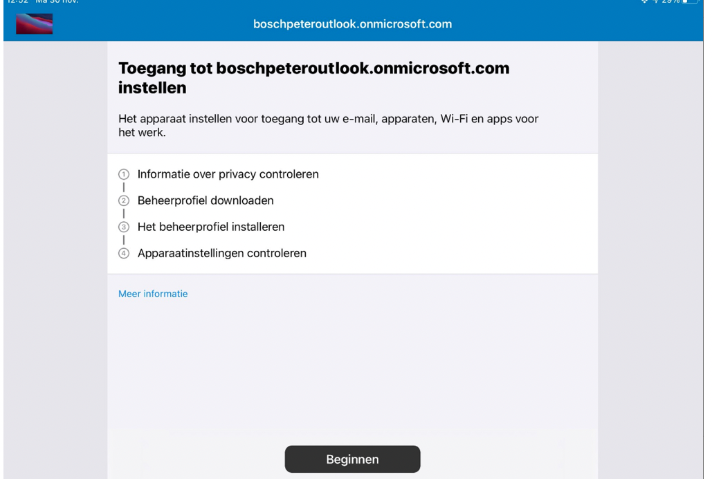
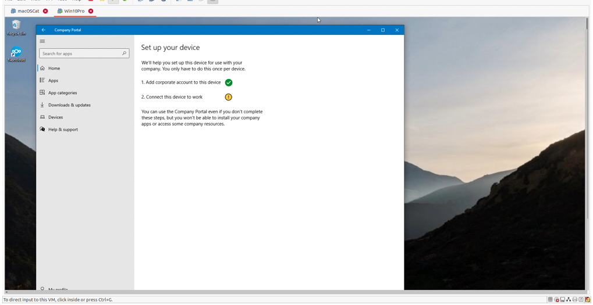
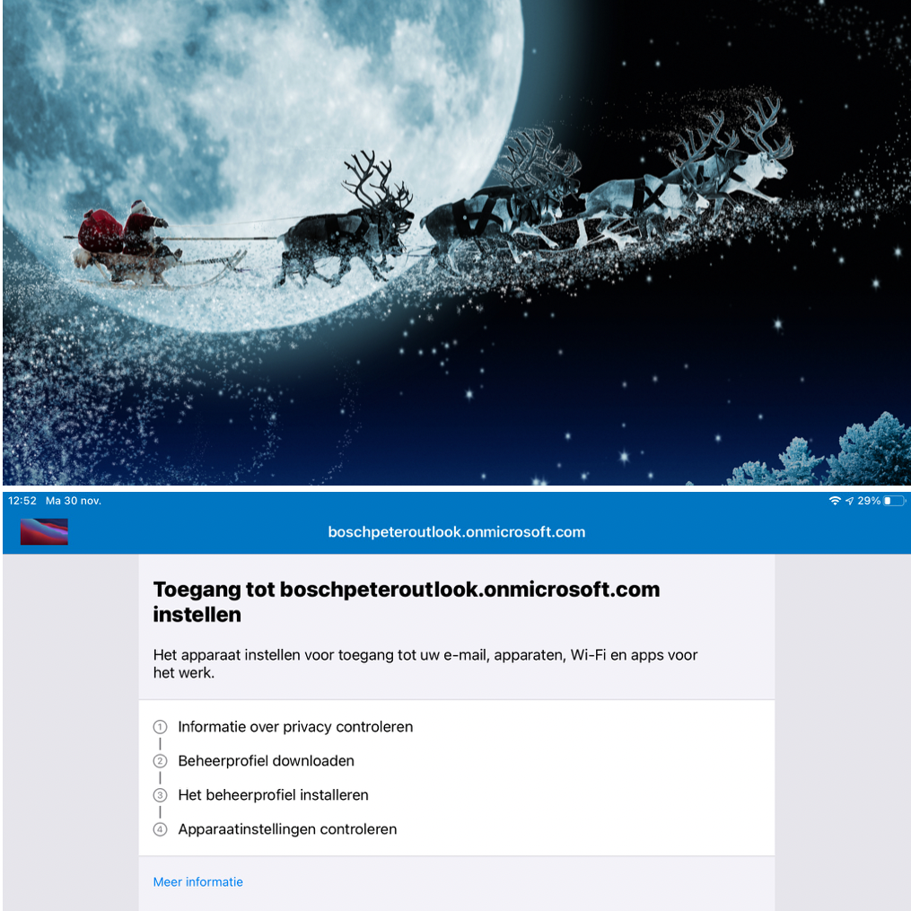

## Ehm… Ja. Nog steeds gekke tijden hè? 

Normaal gesproken probeer ik een beetje weg te blijven van het nieuws, ik denk niet dat dit de plek er voor is. 

Maar tegelijkertijd denk ik dat de "harde lockdown", die in Nederland geldt tot 20 januari, moeilijk te negeren is.

e beste laptop nu lijkt heel veel op jouw iPad-opstelling.    

Ik leef in een klein wereldje, maar best wel magisch.   

Bordspelletjes die je via internet kunt spelen. Misschien ook leuk voor de kerst, wanneer je nu niet "echt" samen kunt zijn, maar dan toch "iets" hebt.

https://applecoach.nl/bordspelletjes-internet/

En als je specifiek instructies zoekt voor Wordfeud: https://applevideo.nl/wordfeud/

(Daarnaast hebben een aantal mensen toen het spel WordCrex getipt. Misschien leuk om te kijken als je net iets anders wilt dan gewoon Scrabble spelen.

 voor de Apple Coach Academie, en laten je zien hoe je FaceTime (op de Mac, iPhone, of iPad) kunt gebruiken om te bellen:

Voor de Mac: https://applevideo.nl/facetime-mac/
Voor de iPad en iPhone: https://applevideo.nl/facetime-ipa

Daarnaast  nog een aantal andere leuke ideeën voor het gebruik van FaceTime: https://applecoach.nl/facetime-ideeen/

Donderdag kofjens kofjens ?  We koersen op 1e kerstdag , even zien of alles op zijn plek gaat vallen. 

