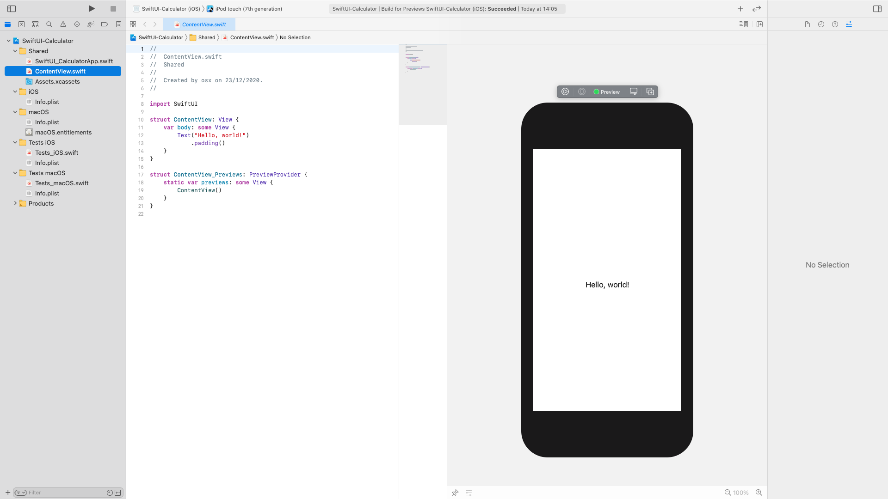
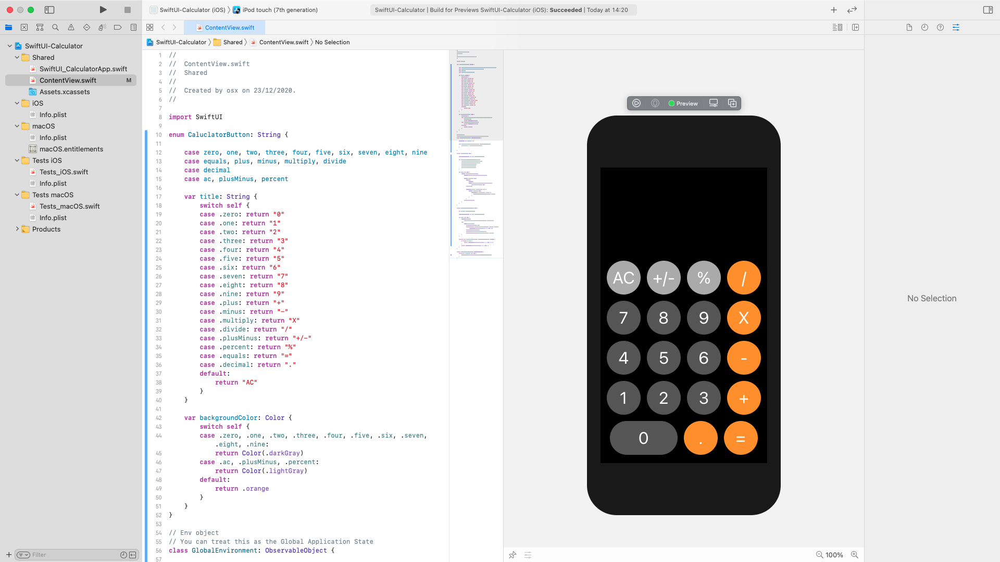

## SwiftUI Calculator Lets Build That App

|ep#|youtube|
|--|--------------------------------------------|
|EP 1|[SwiftUI Calculator - Master Stacking (Ep 1)](https://www.youtube.com/watch?v=ULEFrRSPXFE)
|EP 2|[SwiftUI: CalculatorButtons with Enumeration and Switches (Ep 2))](https://www.youtube.com/watch?v=_hY6e_LWmtg)


## SwiftUI Calculator - Master Stacking (Ep 1)
[CalculatorSwiftUI](https://github.com/snt-nbzw/CalculatorSwiftUI)

````
//
//  ContentView.swift
//  Shared
//
//  Created by osx on 23/12/2020.
//

import SwiftUI

enum CaluclatorButton: String {

    case zero, one, two, three, four, five, six, seven, eight, nine
    case equals, plus, minus, multiply, divide
    case decimal
    case ac, plusMinus, percent

    var title: String {
        switch self {
        case .zero: return "0"
        case .one: return "1"
        case .two: return "2"
        case .three: return "3"
        case .four: return "4"
        case .five: return "5"
        case .six: return "6"
        case .seven: return "7"
        case .eight: return "8"
        case .nine: return "9"
        case .plus: return "+"
        case .minus: return "-"
        case .multiply: return "X"
        case .divide: return "/"
        case .plusMinus: return "+/-"
        case .percent: return "%"
        case .equals: return "="
        case .decimal: return "."
        default:
            return "AC"
        }
    }

    var backgroundColor: Color {
        switch self {
        case .zero, .one, .two, .three, .four, .five, .six, .seven, .eight, .nine:
            return Color(.darkGray)
        case .ac, .plusMinus, .percent:
            return Color(.lightGray)
        default:
            return .orange
        }
    }
}

// Env object
// You can treat this as the Global Application State
class GlobalEnvironment: ObservableObject {

    @Published var display = ""

    func receiveInput(calculatorButton: CaluclatorButton) {
        self.display = calculatorButton.title
    }

}

struct ContentView: View {

    @EnvironmentObject var env: GlobalEnvironment

    let buttons: [[CaluclatorButton]] = [
        [.ac, .plusMinus, .percent, .divide],
        [.seven, .eight, .nine, .multiply],
        [.four, .five, .six, .minus],
        [.one, .two, .three, .plus],
        [.zero, .decimal, .equals]
    ]

    var body: some View {
        ZStack (alignment: .bottom) {
            Color.black.edgesIgnoringSafeArea(.all)
            
            VStack (spacing: 12) {
                HStack {
                    Spacer()
                    Text(env.display).foregroundColor(.white)
                        .font(.system(size: 64))
                }.padding()

                ForEach(buttons, id: \.self) { row in
                    HStack (spacing: 12) {
                        ForEach(row, id: \.self) { button in
                            CalucalatorButtonView(button: button)
                        }
                    }
                }
            }.padding(.bottom)
        }
    }
}

struct CalucalatorButtonView: View {

    var button: CaluclatorButton

    @EnvironmentObject var env: GlobalEnvironment

    var body: some View {
        Button(action: {
            self.env.receiveInput(calculatorButton: self.button)
        }) {
            Text(button.title)
                .font(.system(size: 32))
                .frame(width: self.buttonWidth(button: button), height:  (UIScreen.main.bounds.width - 5 * 12) / 4)
                .foregroundColor(.white)
                .background(button.backgroundColor)
                .cornerRadius(self.buttonWidth(button: button))
        }
    }

    private func buttonWidth(button: CaluclatorButton) -> CGFloat {
        if button == .zero {
            return (UIScreen.main.bounds.width - 5 * 12) / 4 * 2
        }
        return (UIScreen.main.bounds.width - 5 * 12) / 4
    }
}

struct ContentView_Previews: PreviewProvider {
    static var previews: some View {
        ContentView().environmentObject(GlobalEnvironment())
    }
}

````


## een tweedimensionaal raster met knoppen 


Lots of fun things you can do with SwiftUI's stacking library.  Let's go over how to create a two dimensional grid of buttons in today's video.
Veel leuke dingen die u kunt doen met de stapelbibliotheek van SwiftUI. Laten we eens kijken hoe we in de video van vandaag een tweedimensionaal raster met knoppen kunnen maken.


---





[CalculatorSwiftUI](https://github.com/snt-nbzw/CalculatorSwiftUI)

## SwiftUI: CalculatorButtons with Enumeration and Switches (Ep 2)


|2|[SwiftUI Calculator - Master Stacking (Ep 2)](https://www.youtube.com/watch?v=_hY6e_LWmtg)


